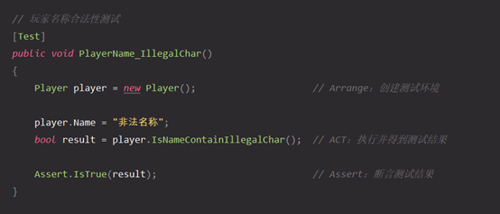
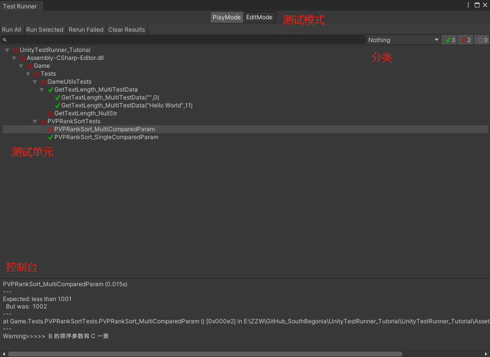
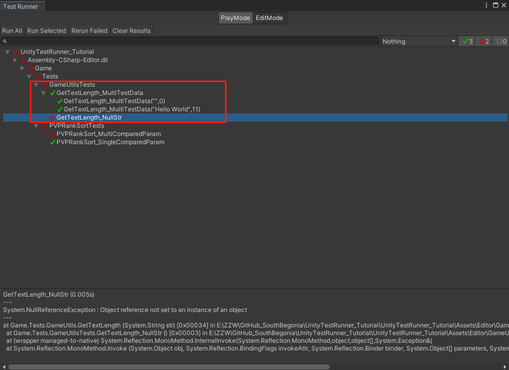
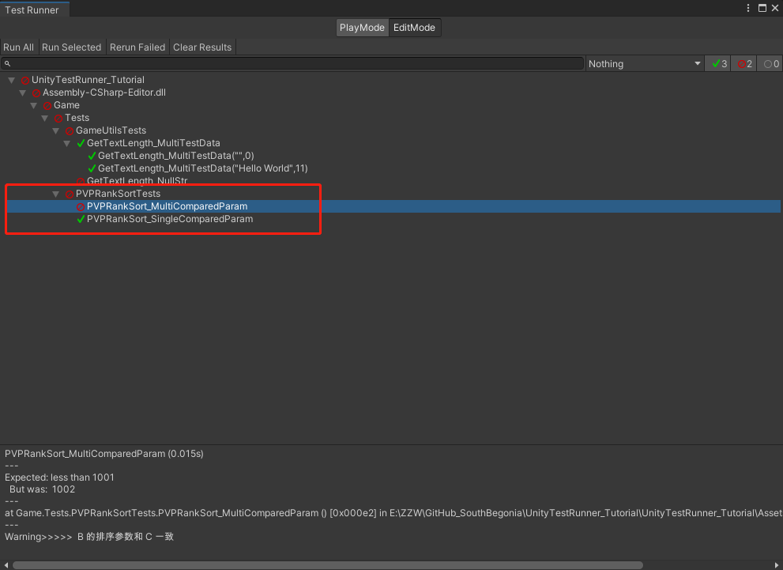

# UnityTestRunner_Tutorial

项目描述：简单演示单元测试在Unity中的应用

项目版本：2020.3.20f1

项目用法：打开就用，代码都放在 Assets/Editor内了

# 单元测试

## 简介

> 单元测试是指对软件中的 **最小可测试单元** 进行检查和验证，一般情况下就是对代码中的 **一个函数** 去进行验证，检查它的 **正确性**。
>
> 单元测试并不测基础结构问题（如数据库、文件系统和网络资源的交互等）。

## 意义

- **节省开发期间的测试时间**

​	相比于以往直接写业务代码、运行Unity跑功能、看断点看日志，单元测试能在编译器模式下快速执行业务逻辑的单元测试

- **有助于完善代码**

​	因为能便捷的添加各类测试数据，所以编写测试代码期间就能发现正式业务代码需要注意的地方（如判空、合法性验证、边界问题、算法复杂度等）

- **减少代码耦合**

​	当代码紧密耦合时，可能难以进行单元测试。 如果不为编写的代码创建单元测试，则耦合可能不太明显，为代码编写测试会自然地解耦代码


## 测试模式

采用  **“Arrange、Act、Assert”**  模式，主要包含3个操作：

1. 安排对象，根据需要对其进行创建和设置

2. 作用于对象

3. 断言某些项按预期进行

   

# Unity Test Runner

## 简介

Unity Test Runner 是 NUnit单元测试框架 在Unity中的实现，可在编辑器模式下执行单元测试。

通过 Window->General->Test Runner 打开页面。双击某测试单元或左上角的 Run All、Run Selected ... 即可执行测试，并输出测试结果到控制台



## 使用流程

1. **编写被测试代码**
   - 被测代码应当是剔除Unity组件交互、资源交互等后的核心算法逻辑。例如某功能模块下的某函数
   - 若被测代码自身已较为独立（如各Utility类），则直接在测试代码内调用即可；否则应当新建被测试类进行测试
   - 新建的被测试类文件可放在Asset->Editor下；采用测试功能名来命名即可

2. **编写测试代码**
   - 测试代码需遵守“Arrange、Act、Assert”模式，且代码能简就简
   - 测试函数需要打 [Test] 或 [TestCase] 标签，详见具体事例或NUnit Attribute
   - 尽量减少if、switch、for等语句的使用（减小测试代码出bug的可能性）
   - Assert断言语句一旦测试失败即抛出，且失败日志的信息较少（只知道失败行和失败结果），因此可辅以Debug日志或断点调试
   - 新建的测试类文件必须放在Asset->Editor下；采用测试功名+Tests来命名

3. **在Unity Test Runner** **页面执行目标测试**
   - 选中较为常用的EditMode
   - 选中各自需测试的单元执行测试即可（如某个测试类或该测试类下的某测试函数）


## 具体事例

### 事例1

需要测试`GameUtils`类下的获取字符串长度函数``GetTextLength()``，在各类传参下能否返回正确长度值。

先新建被测试类`GameUtils`及被测试函数``GetTextLength()``：

```c#
public class GameUtils
{
    public static int GetTextLength(string str)
    {
        // ---------- 错误：缺判空 ----------
        // if (string.IsNullOrEmpty(str))
        // {
        //     return 0;
        // }

        int len = 0;
        for (int i = 0; i < str.Length; i++)
        {
            byte[] byte_len = Encoding.UTF8.GetBytes(str.Substring(i, 1));
            if (byte_len.Length > 1)
                len += 2;
            else
                len += 1;
        }

        return len;
    }
}
```

后新建`GameUtils`的测试用类`GameUtilsTests`，编写`GetTextLength()`的测试函数：

```c#
public class GameUtilsTests
{
    // GetTextLength测试null字符串
    [Test]
    public void GetTextLength_NullStr()
    {
        string str = null;
        int result = GameUtils.GetTextLength(str);
        Assert.AreEqual(0, result);
    }

    // 多测试数据的GetTextLength测试
    [TestCase("", 0)]
    [TestCase("Hello World", 11)]
    public void GetTextLength_MultiTestData(string data, int exResult)
    {
        int result = GameUtils.GetTextLength(data);
        Assert.AreEqual(exResult, result);
    }
}
```

测试结果如下：



### 事例2

需要测试PVP排行榜的排序算法，是否能在单、多排序参数下正确得到排序数据。

先简化排行榜数据单元类为`PVPRankCell`，新建被测试类`PVPRankSort`，编写测试函数`PVPRankCellComparer_BySingleComparedParam()`、`PVPRankCellComparer_ByMultiComparedParam()`，已经用于生成测试数据的方法`GenTestRankList()`：

```c#
//排行榜数据单元
public class PVPRankCell
{
    public string Name;
    public int Score;
    public int RankInGlobal;
    public long PlatformID;
}

public class PVPRankSort
{
    public static int PVPRankCellComparer_BySingleComparedParam(PVPRankCell a, PVPRankCell b)
    {
        //return -a.PlatformID.CompareTo(b.PlatformID); //错误
        return a.PlatformID.CompareTo(b.PlatformID);     //正确
    }

    public int PVPRankCellComparer_ByMultiComparedParam(PVPRankCell a, PVPRankCell b)
    {
        if (a.Score != b.Score)
            return -a.Score.CompareTo(b.Score);

        if (a.RankInGlobal != b.RankInGlobal)
            return a.RankInGlobal.CompareTo(b.RankInGlobal);

        return -a.PlatformID.CompareTo(b.PlatformID); //错误
        //return a.PlatformID.CompareTo(b.PlatformID);     //正确
    }
    
    // 生成测试用数据
    public List<PVPRankCell> GenTestRankList()
    {
        List<PVPRankCell> testRankList = new List<PVPRankCell>
        {
            new PVPRankCell() {Name = "A", Score = 10, RankInGlobal = 3, PlatformID = 1001},
            new PVPRankCell() {Name = "B", Score = 10, RankInGlobal = 3, PlatformID = 1002},
            new PVPRankCell() {Name = "C", Score = 10, RankInGlobal = 3, PlatformID = 1002},    //隐患数据
            new PVPRankCell() {Name = "D", Score = 20, RankInGlobal = 1, PlatformID = 1003},
            new PVPRankCell() {Name = "E", Score = 30, RankInGlobal = 2, PlatformID = 1004},
        };
        return testRankList;
    }
}
```

后新建测试类PVPRankSortTests，编写2个排序算法的测试函数：

```c#
public class PVPRankSortTests
{
    PVPRankSort PvpRankSort;

    [SetUp]
    public void SetUp()
    {
        //最先执行的方法，作为多测试方法的功能部分
        PvpRankSort = new PVPRankSort();
    }

    [TearDown]
    public void TearDowm()
    {
        //最后执行的方法，用于清除或回收公共资源
        PvpRankSort = null;
    }

    // 单一比较参数排序算法的测试
    [Test]
    public void PVPRankSort_SingleComparedParam()
    {
        // Arrange：安排对象，根据需要对其进行创建和设置
        //        如构造测试用数据
        List<PVPRankCell> testRankList = PvpRankSort.GenTestRankList();

        // Act：作用于对象
        //        如具体算法实现
        testRankList.Sort(PVPRankSort.PVPRankCellComparer_BySingleComparedParam);

        // Assert：断言某些项按预期进行
        //        如结果校验：PlatformID升序
        for (int index = 0; index + 1 < testRankList.Count; ++index)
        {
            if (testRankList[index].PlatformID != testRankList[index + 1].PlatformID)
                Assert.Less(testRankList[index].PlatformID, testRankList[index + 1].PlatformID); //PlatformID升序
            else
                Debug.LogWarning($"Warning>>>>>  {testRankList[index].Name} 的排序参数和 {testRankList[index + 1].Name} 一致"); //隐患情况
        }
    }

    // 多比较参数排序算法的测试
    [Test]
    public void PVPRankSort_MultiComparedParam()
    {
        // Arrange：安排对象，根据需要对其进行创建和设置
        //        如构造测试用数据
        List<PVPRankCell> testRankList = PvpRankSort.GenTestRankList();

        // Act：作用于对象
        //        如具体算法实现
        testRankList.Sort(PvpRankSort.PVPRankCellComparer_ByMultiComparedParam);

        // Assert：断言某些项按预期进行
        //        如结果校验：分数降序->名次升序->PlatformID升序
        for (int index = 0; index + 1 < testRankList.Count; ++index)
        {
            if (testRankList[index].Score != testRankList[index + 1].Score)
                Assert.Greater(testRankList[index].Score, testRankList[index + 1].Score); //分数降序
            else if (testRankList[index].RankInGlobal != testRankList[index + 1].RankInGlobal)
                Assert.Less(testRankList[index].RankInGlobal, testRankList[index + 1].RankInGlobal); //排名升序
            else if (testRankList[index].PlatformID != testRankList[index + 1].PlatformID)
                Assert.Less(testRankList[index].PlatformID, testRankList[index + 1].PlatformID); //PlatformID升序
            else
                Debug.LogWarning($"Warning>>>>>  {testRankList[index].Name} 的排序参数和 {testRankList[index + 1].Name} 一致"); //隐患情况
        }
    }
}
```

测试结果如图：



#  其他

## NUnit Attribute

### TestAttribute

常用标签，标记该方法能被执行测试，方法必须为public void 无参

```c#
// GetTextLength测试null字符串
[Test]
public void GetTextLength_NullStr()
{
    string str = null;
    int result = GameUtils.GetTextLength(str);
    Assert.AreEqual(0, result);
}
```

### TestCaseAttribute

标记该方法能被执行测试，方法必须为public void，可传参，参数由TestCase传入

```c#
// 多测试数据的GetTextLength测试
[TestCase("", 0)]
[TestCase("Hello World", 11)]
public void GetTextLength_MultiTestData(string data, int exResult)
{
    int result = GameUtils.GetTextLength(data);
    Assert.AreEqual(exResult, result);
}
```

### TestFixtureAttribute

暂无需使用。用于标记一个类为测试类，其中此类必须是public，必须保证此构造函数不能有任何的副作用（不能出现异常或者错误的情况），在一个测试过程中，可以被构造多次。如果构造函数带有参数，可以指定默认的初始化参数

### SetUpAttribute

标记该方法在测试流程中被首先执行，用作初始化公共参数

```c#
PVPRankSort PvpRankSort;

[SetUp]
public void SetUp()
{
    //最先执行的方法，作为多测试方法的功能部分
    PvpRankSort = new PVPRankSort();
}
```

### TearDownAttribute

标记该方法被最后执行，用作回收公共参数部分，与SetUp配对使用

```c#
[TearDown]
public void TearDowm()
{
    //最后执行的方法，用于清除或回收公共资源
    PvpRankSort = null;
}
```

### CategoryAttribute

给该测试方法打筛分标签，在UnityTestRunner页面可筛分显示（但有特殊字符限制）

### RepeatAttribute

标记该测试方法重复执行指定次数

# 参考文章

- [Unity 基础 之 简单介绍与使用 单元测试 Test Runner / Assert 基于 2019.3.x ](https://blog.csdn.net/u014361280/article/details/116612263?utm_medium=distribute.pc_relevant.none-task-blog-2~default~baidujs_title~default-0.no_search_link&spm=1001.2101.3001.4242)

- [【Unity游戏开发】浅谈Unity游戏开发中的单元测试](https://www.cnblogs.com/msxh/p/7354229.html)

- [使用 NUnit 和 .NET Core 进行 C# 单元测试](https://docs.microsoft.com/zh-cn/dotnet/core/testing/unit-testing-with-nunit)

- [Unity技术之NUnit 第三章：标签(Attribute)详解](https://blog.csdn.net/mingtianqingtian/article/details/97762033)